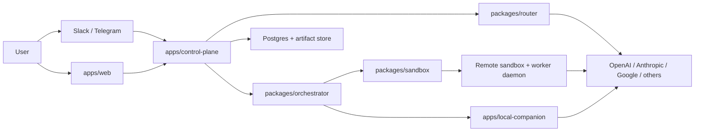

# Architecture

## Architectural stance

Build a new TypeScript monorepo control plane and extract the best engineering ideas from the reference repos. Do not fork any one codebase and try to mutate it into the product.

That gives us:

- a clean domain model
- explicit package boundaries
- less inherited product baggage
- easier future replacement of extracted components

## Top-level system

## Product kernel

### Applications

- `apps/web`
  - Next.js operator console
  - onboarding
  - live run monitoring
  - approvals
  - artifacts
  - router policy
  - schedules
  - workspace settings

- `apps/control-plane`
  - Node/TypeScript control plane
  - orchestration entrypoint
  - persistence
  - realtime events
  - messaging ingress
  - schedules
  - approval handling
  - worker coordination

- `apps/local-companion`
  - outbound edge agent running on the user's machine
  - local browser/session/file access
  - narrow, signed task execution

### Packages

- `packages/protocol`
  - typed HTTP and realtime contracts
- `packages/orchestrator`
  - foreman logic
  - plan graph
  - retries
  - synthesis
  - escalation
- `packages/router`
  - capability-to-provider/model policy engine
- `packages/sandbox`
  - remote sandbox lifecycle and worker session management
- `packages/worker-daemon`
  - runtime process inside remote sandboxes
- `packages/messaging`
  - Slack and Telegram adapters
- `packages/artifacts`
  - artifact store
  - preview metadata
  - safe path handling
- `packages/db`
  - schema
  - migrations
  - query layer
  - state machine helpers

## Why this split

- `OpenClaw` is the best reference for control-plane surfaces.
- `Middleman` is the best reference for delegation behavior.
- `Terragon` is the best reference for run lifecycle and remote execution.
- `Deer Flow` is the best reference for resumable task streaming and artifact UX.

Each repo is useful, but none of them matches the full product shape cleanly enough to be the base.

## Core boundaries

### Control plane

Owns durable state, orchestration, approvals, schedules, routing decisions, and event fanout.

### Worker runtime

Owns actual task execution in a sandbox or local companion environment.

### Provider layer

Owns model/provider selection and fallback based on explicit router policy.

### Surface layer

Owns web and messaging ingress/egress. It should not own core execution logic.

## Build-from-reference map

- `OpenClaw`
  - keep session/workspace ideas, approvals, plugin and skills substrate, messaging adapter patterns
  - ignore channels, canvas, voice/mobile shell

- `Middleman`
  - keep manager-worker decomposition, escalation loop, synthesis pattern
  - ignore persistence and UI as architectural anchors

- `Terragon`
  - keep sandbox lifecycle, daemon model, run state machine, checkpoint instincts
  - ignore SaaS/admin/billing surface

- `Deer Flow`
  - keep thread-scoped artifacts, checkpoint provider ideas, subtask event UX
  - ignore LangGraph as the product core
