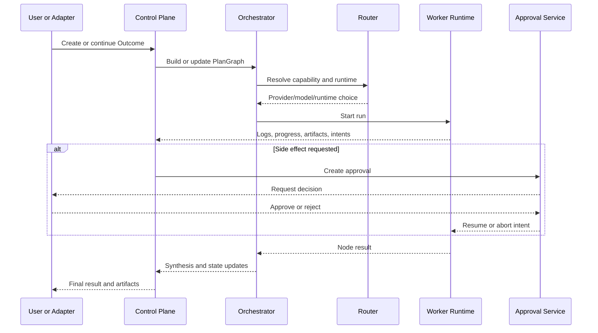

# System Design

## Dominant runtime object

The dominant object is `Outcome`.

Everything else hangs off it:

- messages
- plan graph
- runs
- artifacts
- approvals
- schedules
- memory

Chat is a surface. An outcome is the workflow.

## Domain entities

- `Workspace`
  - deployment boundary
  - provider credentials
  - router policy
  - messaging configuration

- `User`
  - single admin in v1
  - still modeled explicitly for future multi-user support

- `Outcome`
  - user-requested workflow
  - prompt
  - channel/source
  - target deliverables
  - current status

- `OutcomeMessage`
  - chat and event-adjacent conversational log attached to an outcome

- `PlanNode`
  - unit of delegated work
  - capability
  - dependencies
  - target runtime
  - expected output

- `PlanEdge`
  - dependency relation between nodes

- `Run`
  - one execution attempt for a plan node

- `WorkerSession`
  - long-lived session tied to a sandbox or local companion

- `Artifact`
  - generated file
  - preview
  - diff
  - document
  - link
  - structured result

- `Approval`
  - request to authorize a side effect

- `Schedule`
  - recurring or manual trigger bound to an outcome template

- `RouterPolicy`
  - explicit mapping from capability to ordered provider/model candidates

- `MemoryRecord`
  - durable facts, summaries, project context, and handoff state

## Status models

### Outcome status

- `draft`
- `planning`
- `queued`
- `running`
- `blocked_on_approval`
- `scheduled`
- `completed`
- `failed`
- `cancelled`

### Plan node status

- `pending`
- `ready`
- `running`
- `blocked`
- `completed`
- `failed`
- `cancelled`

### Run status

- `starting`
- `streaming`
- `waiting_for_approval`
- `checkpointing`
- `completed`
- `failed`
- `aborted`
- `timed_out`

## Execution path

## Execution environments

### Remote sandbox

Default environment for:

- browser automation
- terminal work
- generated files
- API calls
- document pipelines

### Local companion

Use only when the task requires:

- local files
- local applications
- local authenticated browser sessions
- user-owned contexts unavailable to the remote sandbox

## Approval boundary

Autonomous without approval:

- browsing and search
- summarization
- drafting
- dry-run planning
- sandboxed file generation
- other read-only work

Approval required:

- external writes
- posts, messages, and emails
- third-party mutations
- privileged terminal commands
- connector mutations
- persistent schedule creation
- local-companion actions outside pre-approved scopes

## Missing pieces we must engineer directly

These are not solved cleanly enough by any one reference project:

- `PlanGraph` execution engine with dependency-aware scheduling
- provider routing policy engine with deterministic fallback
- BYO-key cost and budget ledger
- artifact graph and lineage model
- workspace and branch lease manager
- replayable audit model
- human review queue as a first-class primitive

## Recovery model

- control-plane state lives in Postgres
- artifacts, logs, previews, and checkpoints live behind a blob abstraction
- workers checkpoint at meaningful boundaries, not every token
- reconnecting workers resume streaming into the same run
- scheduled runs use the exact same pipeline as interactive runs
